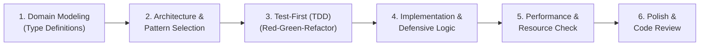

# Clean Code & Software Craftsmanship Skill

This skill guides you through writing clean, robust, idiomatic, and maintainable software. It establishes strict software engineering standards, architectural patterns, defensive programming paradigms, testing strategies, and refactoring techniques.

---

## Core Engineering Principles

When designing or writing software, adhere to these fundamental principles:

1. **SOLID Principles**:
   - **Single Responsibility (SRP)**: A module, class, or function should have one reason to change.
   - **Open/Closed (OCP)**: Software entities should be open for extension, but closed for modification.
   - **Liskov Substitution (LSP)**: Subtypes must be substitutable for their base types without altering program correctness.
   - **Interface Segregation (ISP)**: Clients should not be forced to depend on methods they do not use. Prefer small, focused interfaces.
   - **Dependency Inversion (DIP)**: Depend upon abstractions (interfaces), not concretions. Decouple high-level policy from low-level details.

2. **KISS (Keep It Simple, Stupid) & YAGNI (You Aren't Gonna Need It)**:
   - Avoid premature abstraction and over-engineering.
   - Implement what is required now with clear extension points, rather than speculating on future needs.

3. **DRY (Don't Repeat Yourself) with Pragmatism**:
   - Centralize business logic and domain rules.
   - Avoid accidental coupling: duplicate code is cheaper than the wrong abstraction.

4. **Composition Over Inheritance**:
   - Prefer composing objects and leveraging interfaces/traits over deep inheritance hierarchies.

5. **Principle of Least Surprise**:
   - Function signatures, return types, and side effects must behave intuitively and predictably.

---

## Standard Feature Implementation Workflow

Follow this 6-step lifecycle when developing any new feature or module:

### Step 1: Type-First Domain Modeling
- Define the public contracts, entities, and data models **before** writing implementation logic.
- Use strict type systems to make illegal states unrepresentable (algebraic data types, discriminated unions, non-nullable types).
- Separate data structures (DTOs/Value Objects) from operational behavior.

### Step 2: Architecture & Pattern Selection
- Choose the appropriate design pattern for the problem:
  - *Need multiple variations of an algorithm?* $\rightarrow$ **Strategy Pattern**
  - *Need step-by-step object construction?* $\rightarrow$ **Builder Pattern**
  - *Need decoupling between producers and consumers?* $\rightarrow$ **Observer / Pub-Sub**
  - *Need cross-cutting concerns (logging, auth, retry)?* $\rightarrow$ **Decorator / Middleware / Pipeline**
- Refer to [design_patterns.md](./references/design_patterns.md) for detailed reference implementations.

### Step 3: Test-First Development (TDD)
- Write tests that capture specifications and edge cases before writing production code.
- Follow the **AAA Pattern** (Arrange, Act, Assert).
- Keep tests fast, isolated, deterministic, and self-contained.
- Refer to [testing_strategies.md](./references/testing_strategies.md).

### Step 4: Implementation & Defensive Coding
- **Guard Clauses**: Validate inputs at boundary entry points and return/fail early.
- **Explicit Error Handling**: Prefer explicit `Result<T, E>` / typed errors over unhandled exceptions.
- **Null Safety**: Avoid raw `null`/`nil`/`undefined`. Leverage `Optional`, `Option`, or explicit null checks.
- **Concurrency & State**: Prefer immutability. Guard shared mutable state with appropriate synchronization primitives or channel-based communication.
- Refer to [defensive_programming.md](./references/defensive_programming.md).

### Step 5: Optimization & Resource Management
- Ensure all acquired resources (file handles, database connections, streams, timers, thread pools) are deterministically closed/released (`defer`, context managers, `try-with-resources`, RAII).
- Analyze computational complexity: avoid accidental $O(N^2)$ loops, excessive heap allocations, or $N+1$ query cascades.

### Step 6: Refactoring & Code Polish
- Review code against code smells: eliminate long methods, dead code, primitive obsession, and deep nesting.
- Ensure naming is intent-revealing: functions describe actions (`calculateTax`, `verifyCredentials`), variables describe domain concepts (`activeSessionCount`, `userEmailAddress`).
- Refer to [refactoring_recipes.md](./references/refactoring_recipes.md).

---

## Language Idioms Quick Reference

Always write code idiomatic to the target ecosystem:

| Language | Idiomatic Directives |
| :--- | :--- |
| **TypeScript / JS** | Strict types (`noImplicitAny`), discriminated unions, `readonly` immutability, `async/await` with `Promise.allSettled`, Zod/valibot schemas at boundaries. |
| **Python** | PEP 8, strict type hints (`typing`), `@dataclass(frozen=True)` or Pydantic, context managers (`with`), list/dict comprehensions, explicit exception hierarchies. |
| **Go** | Return `(T, error)` explicitly, accept interfaces / return structs, small single-method interfaces (`io.Reader`), goroutines with `context.Context` cancellation. |
| **Rust** | Leverage ownership/borrow checker, use `Option<T>` and `Result<T, E>` with `?` operator, implement standard traits (`Debug`, `Clone`, `From`/`Into`), zero-cost abstractions. |
| **Java / Kotlin / C#**| Records / data classes, Stream API / LINQ, dependency injection, nullable reference types, immutable collections. |

> Deep dives for each language are available in [language_idioms.md](./references/language_idioms.md).

---

## Quality & Definition of Done Checklist

Before concluding any coding task, verify every item on this checklist:

- [ ] **Type Safety**: Are all types explicit, strict, and avoiding unsafe escapes (no `any`, `@ts-ignore`, unchecked casts)?
- [ ] **Error Propagation**: Are all error cases handled gracefully with descriptive context?
- [ ] **Edge Cases**: Are empty collections, null inputs, boundary indices, and network timeouts handled?
- [ ] **Resource Cleanup**: Are all file handles, sockets, database transactions, and background workers released?
- [ ] **Test Coverage**: Are unit tests written, passing, and covering both happy and failure paths?
- [ ] **Self-Documenting**: Are names clear, abbreviations avoided, and complex algorithms documented with explanatory comments?

