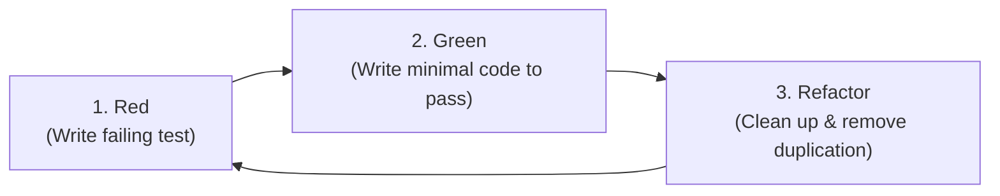

# Testing Strategies & Test-Driven Development (TDD) Reference

High quality tests act as executable specifications, regression safety nets, and architectural design feedback.

---

## 1. The Test Pyramid

```
        / \
       /   \        E2E Tests (Few, slow, test full user journeys)
      /-----\
     /       \      Integration Tests (Test database/API boundaries)
    /---------\
   /           \    Unit Tests (Many, lightning fast, isolated domain tests)
  /-------------\
```

- **Unit Tests (70-80%)**: Test pure business logic, calculations, domain entities, and algorithms in isolation without external I/O.
- **Integration Tests (15-20%)**: Test persistence layers, database queries, wire format serialization, external API contracts.
- **End-to-End Tests (5-10%)**: Test critical end-to-end paths (e.g. user signup, checkout transaction).

---

## 2. Test-Driven Development (TDD) Workflow



1. **Red**: Write a test expressing the requirement. Run it to verify it fails for the right reason.
2. **Green**: Implement the simplest code necessary to make the test pass.
3. **Refactor**: Clean up the implementation, improve readability, extract constants/helpers while keeping the test suite green.

---

## 3. The AAA Pattern (Arrange, Act, Assert)

Structure every test clearly with three distinct phases:

```typescript
describe('ShoppingCart', () => {
  it('should apply a 10% promotional discount when voucher is applied', () => {
    // 1. Arrange: Setup initial state and test data
    const cart = new ShoppingCart();
    cart.addItem({ id: 'item_1', price: 100, quantity: 2 }); // $200 total
    const voucher = new PromoVoucher({ discountPercentage: 10 });

    // 2. Act: Execute the target behavior under test
    cart.applyVoucher(voucher);
    const finalPrice = cart.calculateTotal();

    // 3. Assert: Verify expected outcome
    expect(finalPrice).toBe(180);
  });
});
```

---

## 4. Test Doubles: Fakes vs Mocks vs Stubs

| Type | Purpose | When to Use |
| :--- | :--- | :--- |
| **Fake** | Working implementation with a lightweight shortcut (e.g., `InMemoryUserRepository`). | **Preferred**: Fast, realistic, reusable across multiple test suites. |
| **Stub** | Returns fixed canned responses to method calls. | Good for querying static external responses. |
| **Mock** | Object configured with expectations on how it will be called (verifies method calls). | Use sparingly when verifying side effects (e.g. email dispatcher was called once). |

### Example: Prefer In-Memory Fakes over Fragile Mocks
```typescript
export class InMemoryUserRepository implements UserRepository {
  private users = new Map<string, User>();

  async findById(id: string): Promise<User | null> {
    return this.users.get(id) ?? null;
  }

  async save(user: User): Promise<void> {
    this.users.set(user.id, user);
  }
}
```

---

## 5. Table-Driven & Parameterized Testing

Test edge cases and boundary conditions cleanly without code duplication:

### Go Example
```go
func TestCalculateTax(t *testing.T) {
    tests := []struct {
        name     string
        income   float64
        expected float64
    }{
        {name: "Zero income", income: 0, expected: 0},
        {name: "Low income bracket", income: 10000, expected: 1000},
        {name: "Medium income bracket", income: 50000, expected: 8500},
        {name: "High income bracket", income: 150000, expected: 35000},
    }

    for _, tt := range tests {
        t.Run(tt.name, func(t *testing.T) {
            got := CalculateTax(tt.income)
            if got != tt.expected {
                t.Errorf("CalculateTax(%v) = %v; want %v", tt.income, got, tt.expected)
            }
        })
    }
}
```

