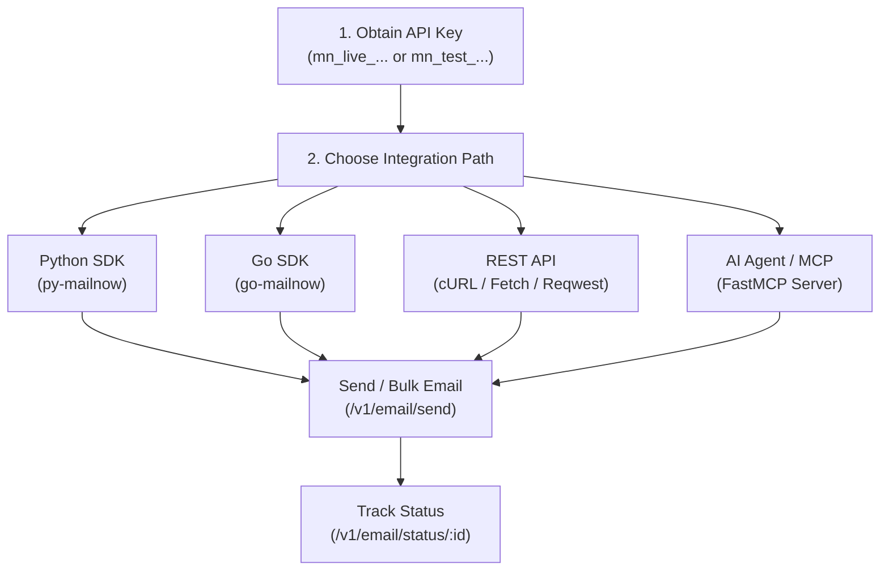

# MailNow Email API & SDK Integration Skill

This skill guides you through integrating MailNow (`mailnow.xyz`) into backend applications and AI agent workflows. It covers transactional email dispatch, bulk email queuing, status checking, email template rendering, official Python (`py-mailnow`) and Go (`go-mailnow`) SDKs, FastMCP server deployment, and REST API implementations across multiple languages.

---

## Core MailNow Rules & Directives

1. **API Key Security & Environment Isolation**:
   - Production API keys use the prefix `mn_live_...` and must reside exclusively on secure backend servers or environment variables (`MAILNOW_API_KEY`).
   - Sandbox / testing API keys use the prefix `mn_test_...` for development environments without sending live emails.
   - Never commit API keys to version control or expose them on client-side frontend code.

2. **Authentication Header**:
   - All REST requests to `https://api.mailnow.xyz/v1/*` must provide the API key in the `X-API-Key` HTTP request header:
     ```http
     X-API-Key: mn_live_your_api_key_here
     Content-Type: application/json
     ```

3. **Credit Quotas & Rate Limits**:
   - Each single email dispatch (`/v1/email/send`) deducts **1 credit** upon queueing.
   - Bulk email dispatch (`/v1/email/send/bulk`) deducts **1 credit per recipient**.
   - HTTP `429 Rate Limit` indicates exhausted account credits. Quotas reset monthly according to the billing cycle.

4. **Sender & Content Requirements**:
   - Every email request must include `from`, `to`, and `subject`.
   - Content must supply at least one of: `html`, `text`, or `template_id`.

---

## Standard Integration Workflows



### Workflow 1: Single Transactional Email Dispatch
1. Provide sender (`from`), recipient (`to`), and subject line (`subject`).
2. Provide content via HTML (`html`), plain text (`text`), or saved template (`template_id`).
3. Optionally attach files using base64 encoded strings in the `attachments` array.
4. On success (`200 OK`), record the returned `message_id` (e.g. `msg_df7e20ec42a8b9e1`) for delivery tracking.
> See [api_reference.md](./references/api_reference.md) and [code_examples.md](./references/code_examples.md).

### Workflow 2: Bulk Email Dispatch
1. Supply an array of recipient email strings in the `to` field (e.g. `["user1@example.com", "user2@example.com"]`).
2. Submit the payload to `POST /v1/email/send/bulk`.
3. Receive individual `message_id` values per recipient in the `data.results` response array.
> See [api_reference.md](./references/api_reference.md) for bulk response schemas.

### Workflow 3: Delivery Status Tracking
1. Fetch delivery records using `GET /v1/email/status/{message_id}`.
2. Inspect the returned status: `queued`, `success`, or `failed`.
> See [api_reference.md](./references/api_reference.md).

### Workflow 4: AI Agent & MCP Server Integration
1. Run the MailNow FastMCP server locally via STDIO (`python server.py` or `uv run server.py`) or remote SSE (`MCP_TRANSPORT=sse MCP_PORT=8080`).
2. Provide tools: `send_email`, `check_status`, and `list_templates` to AI assistants (Claude Desktop, Cursor, Antigravity).
> See [mcp_server.md](./references/mcp_server.md) for tool signatures and configuration files.

---

## Reference Guides Index

| Topic | Reference Document |
| :--- | :--- |
| **REST API Specification** | [api_reference.md](./references/api_reference.md) |
| **Python SDK (`py-mailnow`)** | [python_sdk.md](./references/python_sdk.md) |
| **Go SDK (`go-mailnow`)** | [go_sdk.md](./references/go_sdk.md) |
| **MCP Server (FastMCP & AI Agents)** | [mcp_server.md](./references/mcp_server.md) |
| **Multi-Language Code Examples** | [code_examples.md](./references/code_examples.md) |

---

## Integration Checklist

Before deploying MailNow in production, verify:

- [ ] **API Key Environment Variable**: `MAILNOW_API_KEY` is loaded from a secrets manager or `.env` and never hardcoded.
- [ ] **Prefix Check**: Using `mn_live_...` for production and `mn_test_...` for development/staging.
- [ ] **Header Configuration**: Request headers specify `X-API-Key` and `Content-Type: application/json`.
- [ ] **Content Validation**: Email payload contains at least one of `html`, `text`, or `template_id`.
- [ ] **Error Handling**: Code explicitly handles `400` (Validation), `401`/`403` (Auth), and `429` (Rate/Credit limit).
- [ ] **Status Tracking**: Transactional `message_id` is stored in your database to audit delivery status.

